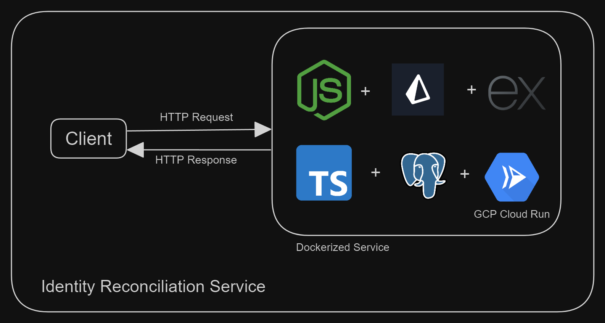

# Identity Reconciler Service

- This has been deployed and available here - [Link]()

### Index

- [Tech Stack](#tech-stack)
- [System Design](#system-design)
- [Setup locally](#setup-locally)

### Tech Stack

- Node.js
- Express.js
- Typescript
- PrismaORM
- PostgreSQL
- Redis
- Docker
- GCP Cloud Run

### System Design



### Setup locally

- Clone repo

  ```
  git clone https://github.com/rahulsm20/bitespeed-assignment
  ```

- Install packages
  ```
  cd bitespeed-assignment && npm i
  ```
- Setup env variables

  ```
  DIRECT_URL=""
  DATABASE_URL=""
  REDIS_HOST=""
  REDIS_PASS=""
  REDIS_PORT=""
  PORT=3000
  ```

- Run in dev mode
  ```
  npm run dev
  ```
  OR
- Run using docker
  ```
    docker build -t bitespeed-server . && docker run -p 3000:3000 bitespeed-server
  ```
